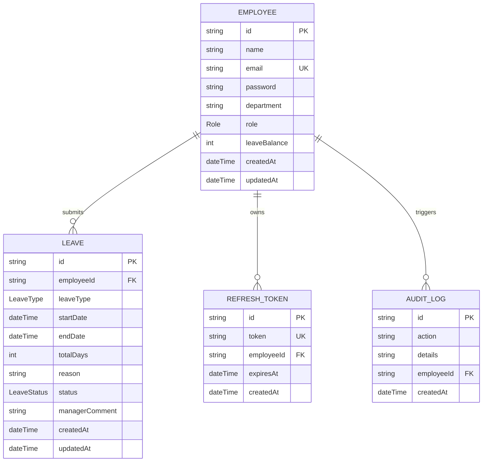

# Database Entity Relationship (ER) Diagram

Below is the visual relationship schema of the Leave Management System database.

## Enum Definitions

### Role
- `EMPLOYEE`
- `MANAGER`

### LeaveType
- `ANNUAL`
- `SICK`
- `CASUAL`
- `MATERNITY`
- `PATERNITY`
- `UNPAID`

### LeaveStatus
- `PENDING`
- `APPROVED`
- `REJECTED`
- `CANCELLED`
